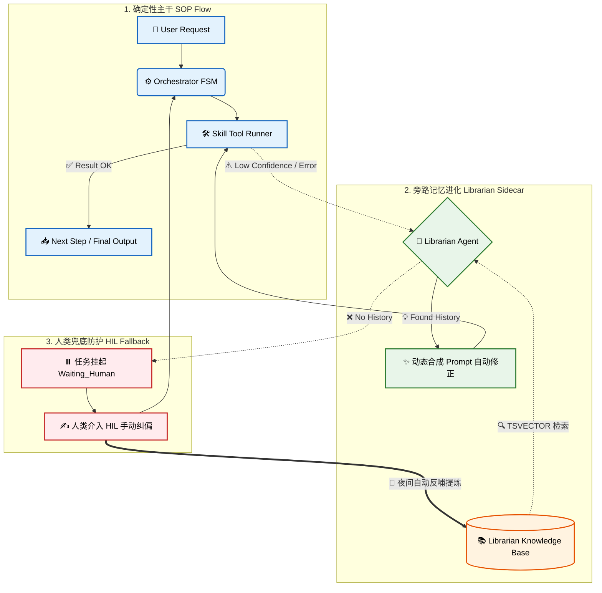
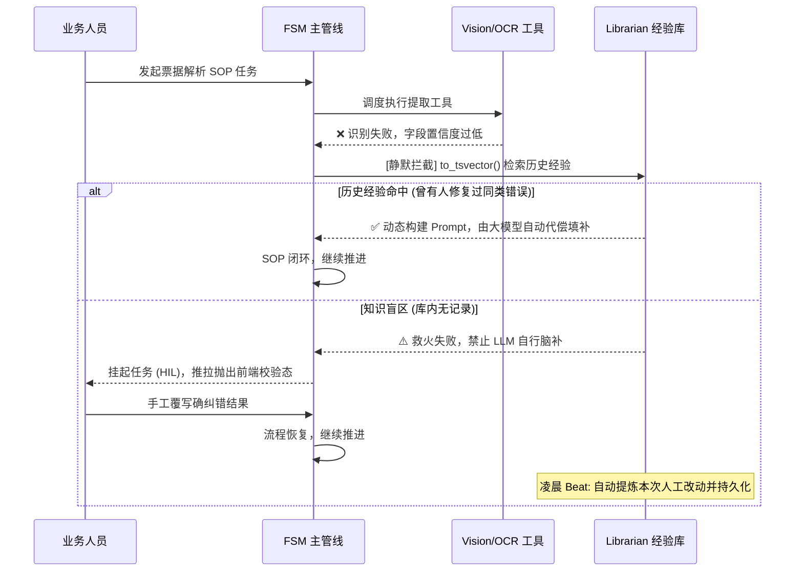
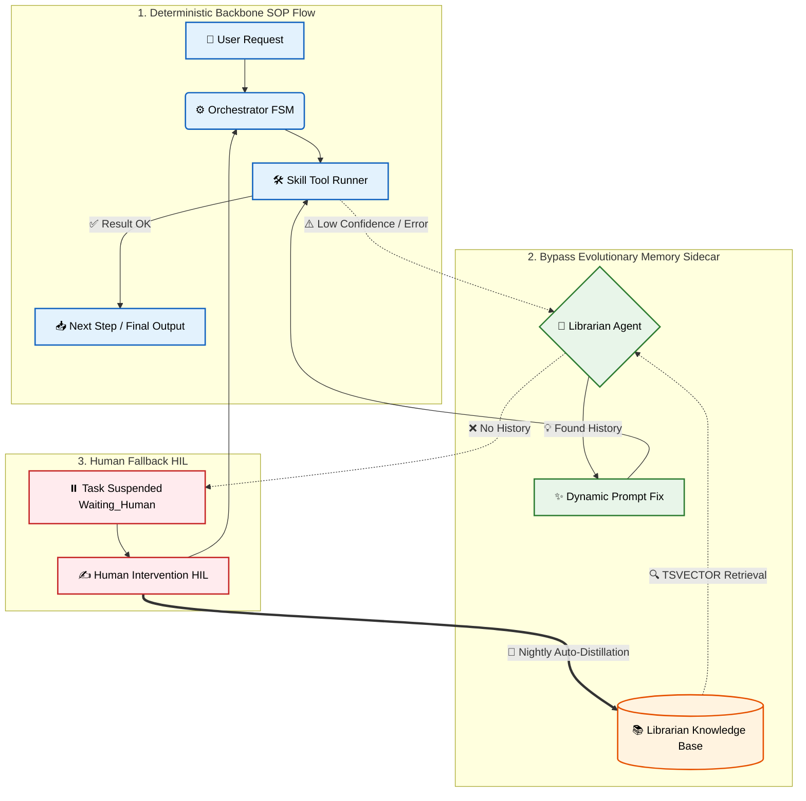
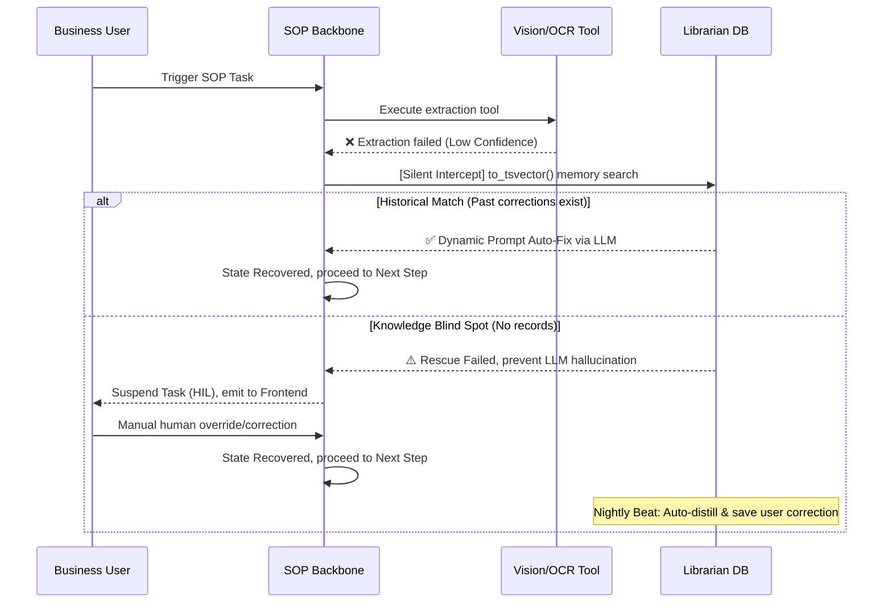

# AI Copilot Platform (Fast-Closure-Report)

[🇨🇳 简体中文](#-简体中文) | [🇺🇸 English](#-english)

> 面向中小型企业 AI Agent 框架，用于解决项目结案报告而生，攻克从“报价-交付”核对到多用户报销审计的所有难题；
>
> 基于Librarian + PostgreSQL JSONB 进行 Memory 自动进化学习，支持 Skill 与 Tools 的拓展与热插拔。

> An AI Agent framework tailored for SMBs, purpose-built to automate project closure reports and tackle everything from quote-to-delivery reconciliations to multi-user expense audits. Powered by a Librarian + PostgreSQL JSONB architecture for self-evolving memory, it fully supports the seamless expansion and hot-plugging of Skills and Tools.

---


## 简体中文

[](LICENSE)
[]()

### 💡 Why AI Copilot Platform?

> 针对当前 DAG/Flow 类框架遭遇复杂业务极易崩溃、LLM 幻觉失控的痛点。我们提供了一种企业级的稳妥范式，让 AI 真正可用，且使用了Librarian + PostgreSQL JSONB 进行 Memory 自动进化学习，让记忆更自洽。

在严谨的财务对账、视觉验收等场景中，绝不能容忍由开源大模型底层“发散式 Planning”引发的流程崩溃。我们要做的是：在控制极度确定的流程之下，放手让 AI 处理其中微观的混乱。

### 🧠 Core Insight：确定性主干 + 非确定性补偿

> 我们不是在做普通的 Agent 工具箱，而是在推行一种全新的架构哲学：
>
> - **FSM 主干 (SOP Flow)：** 控制核心流程，提供强有力的锁链，保障下限与绝对的系统稳定性。
> - **Librarian 旁路 (Memory)：** 负责沉淀人工纠错经验，赋予系统长期自我进化的能力。错误不仅被解决，更是被吸收。
> - **HIL 兜底 (Human-in-the-Loop)：** 作为不可逾越的安全红线。当模型不确信时，让人类成为判官。

### 🏛️ Architecture



### 🚀 Quick Start (3-Minute to Value)

仅需三步，即可在本地唤醒带有记忆引擎的 Agent 服务：

```bash
git clone https://github.com/Marcolexxx/Fast-Closure-Report.git
cd Fast-Closure-Report
cp .env.example .env
# 必须配置您的 VISION_API_KEY 以驱动视觉理解模块
docker-compose up -d
```

> 启动后，API 运行在 `http://localhost:8000`，您可以随即触发自动化协同工作流。

### 🎬 How it works: 真实业务流转 Demo

以处理一张**模糊残缺的发票**为例，系统的防御运转链路机制如下：



### ✨ Key Features

* 🛡️ **SOP 死锁管控**：拒绝不靠谱的 Planning 幻视，流程控制全部交由结构化引擎把关。
* 🧠 **Librarian 经验库**：原生搭载夜间大模型清洗架构，让你的系统记忆自动进化，每天都在变聪明。
* ⏸️ **HIL 强干预**：开创性的非阻塞前端断点唤醒，保障每次不确定决策都有人类把关。
* ⚡ **多副本免责与 DLQ 守护**：内建长连接 Hydration 恢复支持与死亡任务的 Guardian 回收系统，高可用性拉满。

### 📚 Documentation & Advanced Usage

本 README 仅作核心机制展示。部署细节、二次开发、Tool 编写请移步文档库：

- [环境依赖与本地开发/部署指南](./docs/deployment.md)
- [自定义 Skill 与工具 (Tool) 开发手册](./docs/plugins.md)
- [Librarian Agent 记忆引擎原理解析](./docs/architecture.md)
- [数据库实体建模规范 (Database Schema &amp; Indexing)](./docs/database_schema.md)
- [异步全双工推流与 API 规范 (Websocket &amp; REST API)](./docs/websocket_protocol.md)

---


## English

[](LICENSE)
[]()

### 💡 Why AI Copilot Platform?

> Addressing the pain points of current DAG/Flow frameworks that easily collapse under complex business logic and fall victim to unpredictable LLM hallucinations, we offer a stable, enterprise-grade paradigm to make AI truly usable.

In rigorous scenarios such as financial reconciliation and visual inspection ops, an LLM's unrestrained "Planning" often leads to process breakdowns. Our goal: confine AI within an unconditionally deterministic pipeline, and let it freely handle the micro-chaos inside the nodes.

### 🧠 Core Insight: Deterministic Backbone + Non-deterministic Compensation

> We're not building a typical Agent toolbox; we are pioneering a new architectural philosophy:
>
> - **FSM Backbone (SOP Flow):** Controls the core process, offering an ironclad chain that guarantees absolute system stability.
> - **Librarian Sidecar (Memory):** Accumulates human-correction experience, granting the system long-term self-evolution capability. Errors aren't just solved; they are absorbed.
> - **HIL Fallback (Human-in-the-Loop):** Acts as the impassable safety net. When the model is uncertain, the human acts as the ultimate judge.

### 🏛️ Architecture



### 🚀 Quick Start (3-Minute to Value)

Awaken your memory-engine empowered Agent service locally in just three steps:

```bash
git clone https://github.com/Marcolexxx/Fast-Closure-Report.git
cd Fast-Closure-Report
cp .env.example .env
# Be sure to configure your VISION_API_KEY
docker-compose up -d
```

> Once started, the API serves at `http://localhost:8000`, ready for automated workflow triggers.

### 🎬 How it works: Real Business Workflow Demo

How the system behaves when processing a **blurry, damaged invoice**:



### ✨ Key Features

* 🛡️ **SOP Deadlock Governance**: Dismiss ungrounded LLM Planning logic, confining logic flow to a structured engine.
* 🧠 **Librarian Knowledge Base**: Native nightly distillation processes ensure your system evolves daily.
* ⏸️ **HIL Interventions**: Non-blocking interruptions securing unconfident decisions with a human gatekeeper.
* ⚡ **High Availability & DLQ Protection**: Hydration recovery features along with dead-letter task reapers ensure maximum stability.

### 📚 Documentation & Advanced Usage

This README illustrates the core mechanisms. For deployment, deep customization, and tool development, see the docs:

- [Deployment &amp; Env Setup](./docs/deployment.md)
- [Custom Skills &amp; Tools Plugin Guide](./docs/plugins.md)
- [Librarian Agent Engine Architecture](./docs/architecture.md)
- [Database Schema &amp; PostgreSQL Indexing](./docs/database_schema.md)
- [Websocket PubSub &amp; REST API Fallback](./docs/websocket_protocol.md)
