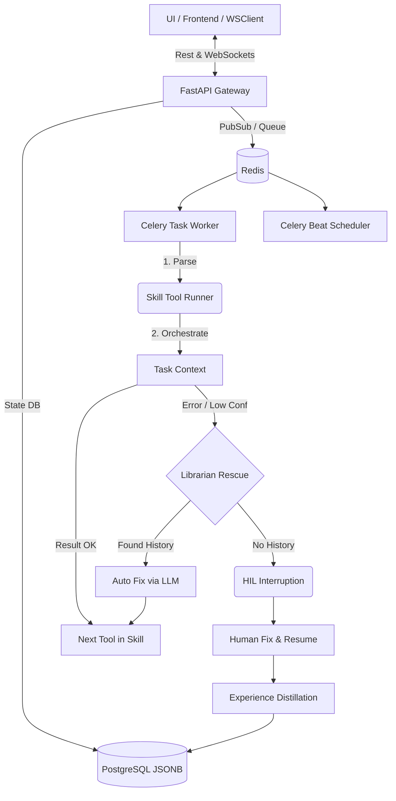

# AI Copilot Platform

> **企业级“人机协同” AI 办公与内容生产引擎，主打全自动流式处理与纠错记忆（Librarian Experience Loop）。**

AI Copilot Platform 是一个面向企业复杂业务场景的自动化 Agent 框架体系。有别于传统的“单轮对话封装（Wrapper）”，本项目聚焦在长链条 SOP 场景，如财务对账、视觉验收、素材分发、自动化报告生成等。

## ✨ 核心特性与竞品优势

- 🧩 **SOP Flow 编排与工具链 (Tool Registry)**：基于预定义领域知识的执行链，系统性调用 OCR、Excel解析、云盘提取、自动化 PPT 构建等 10+ 本地扩展工具。
- ⏸️ **HIL (Human-in-the-Loop) 人机协同中断**：在遇到低置信度（如模糊票据 OCR）或强安全节点时，Agent 自动挂起并向前端推送带有预填数据的交互态，人类确认后安全推进。
- 🧠 **Librarian Memory 经验记忆库（核心杀手锏）**：在 HIL 发生人工纠错时，隐式提取人类经验，夜间批处理自动聚类构建知识树（Nightly Patrol）。下一次 Agent 遇到类似失败时，通过 TSVECTOR 检索底层经验进行 Prompt 增强（Self-Rescue 自动纠错）。
- 🛡️ **高可用死信队列 (Guardian DLQ)**：底层 Celery 长驻多副本节点，拥有 OOM 自愈和“僵尸任务”熔断机制。
- ⚡ **异步全双工通信**：FastAPI + WebSockets + Redis PubSub + Celery 提供非阻塞的进度推流。并且内置了重连时的 State Hydration 和长轮询补偿机制防抖。

> **竞品对比（vs. Dify / Flowise 等开源框架）**：
> 大量开源框架沉迷于 DAG（有向图连接），遭遇复杂业务报错时全盘崩溃。本项目秉承 **“宏观流程 SOP 死锁管控 + 微观异常由 LLM 救火补缺”** 的稳妥路线。在落地可靠度上，实现了让业务员工每一次打回重写，都转化成了大模型自动迭代学习的经验护栏，这在开源组件中绝无仅有。

## 🏛️ 架构透视图



## 🚀 极简上手指南

### 1. 环境依赖基础
- **OS**: Linux / Windows (WSL2 推荐)
- **Runtime**: Python 3.9+, Node.js 18+
- **Databases**: PostgreSQL 14+ (必须，因使用 tsvector 与 JSONB), Redis 7+

### 2. 外部视觉模型接入配置 (.env)
系统不再使用 Mock 的假数据，默认搭载并请求真实的结构化视觉大模型网络。您必须准备一个 OpenAI 兼容的视觉 API 密钥（如 GPT-4o, GPT-4-Vision, Zhipu GLM-4V 或 Qwen-VL 等）：
```ini
VISION_API_KEY="sk-xxxx"
VISION_BASE_URL="https://api.openai.com/v1"
VISION_MODEL_NAME="gpt-4o"
```
*注：系统内置了图像质量压缩隔离阀（Pillow Limit），能将大于极限分辨率的图片自动缩比并控制到合理质量后再行 Base64 编码，无需担忧单次触发的极端 Token 账单爆炸和 OOM。*

### 3. 快速启动 (Docker Compose)
所有核心依赖及组件已被容器化，可实现一键部署：
```bash
# 复制并配置环境变量
cp .env.example .env
# 配置好您的 VISION 变量及其它所需设置
# 启动所有服务 (Postgres, Redis, API, Worker, Nginx, Guardian Task)
docker-compose up -d --build
```

### 4. 本地开发调试
**后端 (Backend):**
```bash
cd backend
python -m venv venv && source venv/bin/activate
pip install -r requirements.txt
# 启动 Uvicorn
uvicorn app.main:app --reload --host 0.0.0.0 --port 8000
# 启动 Celery 与定时巡更防线
celery -A app.celery_app worker -l info
celery -A app.celery_app beat -l info
```

**前端 (Frontend Vite):**
```bash
cd frontend_vite
npm install
npm run dev
```

## 🔌 高阶玩法 / 插件扩展

1. **自定义 Skill 注入**
   在 `backend/skills/` 下新建你的专属 `skill.json`，声明工具节点与交互 UI 组件名。
2. **编写自定义 Tool**
   集成 `ToolResult`，并在 Tool 层直接连接你的企业内网 API。返回结果如果有 `low_confidence` 标记，会自动触发 HIL 协同。
3. **切换 LLM / Vision Adapter**
   系统可通过后台配置决定是走由本地 GPU 处理的局域网推理侧（部署 GroundingDINO 等小模型），还是由 OpenAI 大模型接管（适合极需发散语义理解的复杂图表）。
