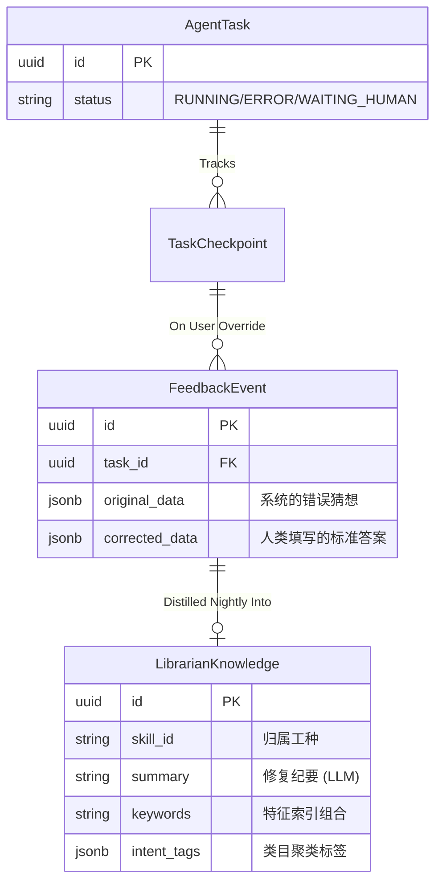

# 核心驱动引擎机制剖析 (Librarian Agent Engine Architecture)

Librarian（经验管理员）并非一个简单的向量数据库应用层调用，它是此框架能在无数非标开源 Wrapper 丛林中立足的**防决堤大坝**。
它巧妙利用大模型+传统关系型数据库底层算子，搭建了一套带有溯线自发进化的“免疫记忆系统”。

## 1. 实体链路与关联模型 (Entity Schema)

要想了解 Librarian，先理清项目底层的数据库推导血脉。通过一张 Mermaid ER 图，我们可以看到纠错记录是怎样顺藤摸瓜入库的。


**一句话概括**：人类帮系统擦的每一次“屁股”（`FeedbackEvent`），都会在深夜被收纳萃脑成了可反查的“秘籍”（`LibrarianKnowledge`）。

## 2. Nightly Patrol：大模型的子夜扫除 (AST Clustering)

仅仅拥有修正记录是不够的。一百个相同的错误如果填进去一百条索引会污染倒排检索池。每晚 03:00 的 `librarian_nightly_patrol` 承担了 AST 剪枝般的聚类任务：

1. **聚合与分流**：根据当日 `FeedbackEvent` 里面的 `skill_id` 进行分流批次。
2. **大模型洗脑合并**：将一堆相似的报错内容合订丢给负责降维总结的大模型。
3. **沉淀结晶**：模型负责吐回结构化的 `intent_tags` 以及一个通配用的精简版 `summary`。

## 3. Self-Rescue：基于 TSVECTOR 的高阶绝地求生

这是真正能体现技术水平的一环。
如果在日常流转中，我们的具体解析步骤 `Skill Runner` 失败了（这极大地触发了 `try-except` 或判定 `low_confidence = True`）。系统自动发起抢救：

```bash
# 截取底层 repository 执行指令：
SELECT id, summary, keywords, intent_tags
FROM "LibrarianKnowledge"
WHERE skill_id = :skill_id AND (
    to_tsvector('simple', keywords || ' ' || summary) @@ to_tsquery('simple', :query)
)
```
- 这里没有去外挂昂贵笨重的 ES 或 Qdrant（对于日常 B 端系统不仅贵还没必要）。
- 利用了 `PG` 内核的倒排索引分词库 `TSVECTOR`。

一旦 `tsvector` 高分切中命中某条类似 `[发票边角磨损引发误算]` 的 `LibrarianKnowledge` 记录。系统马上将该条历史记录与当前报错一并推送给 LLM：“这有个错，这是前人总结的改错经验，你自己重算一次填回去，别再报错了！”
大模型依靠该参考提示执行更正合并，生成的新包被引擎确认 `Result OK`。
系统最终完全向业务端掩耳盗铃，**成功规避并平滑地消除了此报错的影响路径。** 

这，就是企业级 AI 系统的底力之源。
