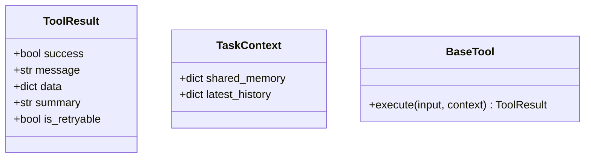

# 自定义插件体系扩展 (Plugins & Tool Development)

我们拒绝 “纯代码硬连接大模型” 的凌乱方案。依托于 `skill.json` 以及松耦合的插件原子函数，开发者无需了解前台展示层的内部机制，就能拓展出无尽的业务处理能力。

## 1. Skill 注册机制与微内核编排

系统会从 `backend/app/skills/` 寻找目录并热加载每个 `skill.json`。其核心理念是一条由状态机（FSM）严格约束的流水线。

```json
{
  "id": "financial-reconcile",
  "name": "财务报表冲算管线",
  "tools": [
    {
      "name": "fetch_bank_slip",
      "type": "auto",
      "async_": true
    },
    {
      "name": "analyze_discrepancy",
      "type": "human_in_loop",
      "ui": "ReconcileReviewScreen"
    }
  ]
}
```

- **`type: auto`**：引擎流到此处将开启无头自动化。
- **`type: human_in_loop`**：执行完毕此处的原函数后，只要您附带了 `hil` 对象响应，状态机 FSM 控制棒便会自动切断进程，将状态定格在 `WAITING_HUMAN`，并将前序计算结果交付指定前端 `ui` (如上述名为 `ReconcileReviewScreen` 的前端 React Component) 等待业务人员介入裁决。

## 2. The Tool Contract (工具协议)

开发单个技能点非常简单。无需深入业务核心代码，你只要实现一个签名为 `TaskContext -> ToolResult` 的协程即可。

### 结构透视



### 开发实战: 编写一个破坏性拦截 Tool
如果你的一步操作危险系数很高或置信失败，你可以这样抛出前端拦截（让业务人员检查）：
```python
import logging
from typing import Dict, Any
from app.tools.base import TaskContext, ToolResult

logger = logging.getLogger(__name__)

async def analyze_discrepancy(input_data: Dict[str, Any], context: TaskContext) -> ToolResult:
    # 模拟外部数据库大模型调用
    discrepancy_amount = 5400.00
    
    if discrepancy_amount > 1000:
        # 大于安全金额，强制切断自动化，呼叫人类审批卡口
        return ToolResult(
            success=True,
            data={
                "parsed_diff": discrepancy_amount,
                # 附带 HIL 卡口特化指令
                "hil": {
                    "ui_component": "ReconcileReviewScreen",
                    "prefill_data": {"amount_to_correct": discrepancy_amount},
                    "reasoning_summary": f"系统发现对冲差异高达 {discrepancy_amount}，因超量必须由财务副主审手动修正！"
                }
            },
            summary="识别拦截完成，强转半自动审核。"
        )
        
    return ToolResult(
        success=True, 
        data={"cleared": True}, 
        summary="自动平账成功。"
    )
```

## 3. 集成第三方工具链 (例如 Langchain 兼容)
得益于我们灵活的入参封装，若您的企业内部有使用 `Langchain Tool` 封装的检索器或 `LlamaIndex` RAG 管线，完全可以包装一层直接对接进来：
```python
async def query_company_wiki(input_data: Dict, context: TaskContext) -> ToolResult:
    # 将本项目标准的执行栈桥接进底层的 RAG 逻辑
    res = await your_langchain_agent.arun(input_data["question"])
    return ToolResult(success=True, data={"rag_answer": res})
```
这避免了底层框架与 Langchain 生态过度绑死的灾难，保持了自身核心的清爽与幂等。
